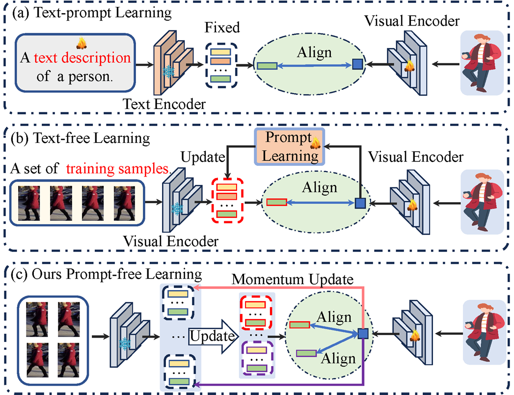
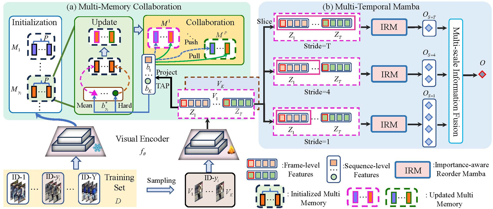
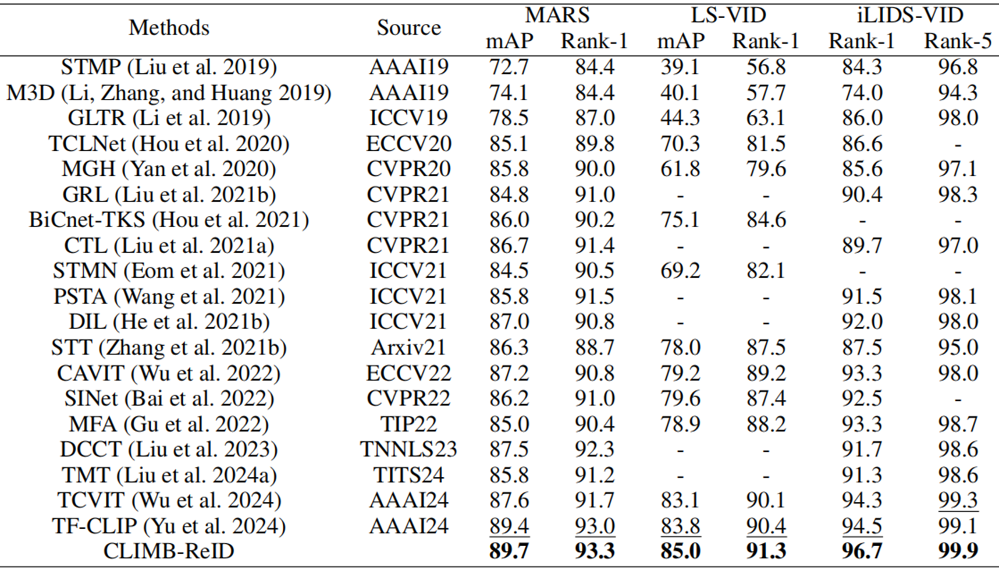
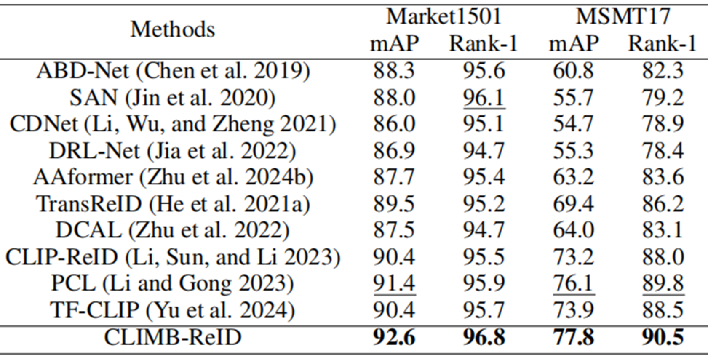
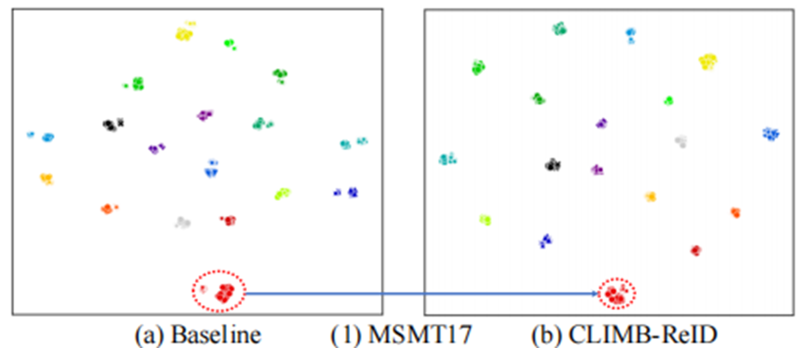

# CLIMB-ReID: A Hybrid CLIP-Mamba Framework for Person Re-Identification（AAAI2025）
<div align=center>

</div>

<div align="center">
    <a href="https://pytorch.org"></a>
    <a href="https://github.com/AsuradaYuci/CLIMB-ReID/blob/main/AAAI-ID-1540-Yu.pdf"></a>
</div>

<div align=center>

</div>

Recently, some works
have suggested using large-scale pre-trained vision-language
models like CLIP to boost ReID performance. Unfortunately,
existing methods still struggle to address two key issues simultaneously:
efficiently transferring the knowledge learned
from CLIP and comprehensively extracting the context information
from images or videos. To address above issues, we
introduce **CLIMB-ReID**, a pioneering hybrid framework that
synergizes the impressive power of CLIP with the remarkable
computational efficiency of Mamba.


## :loudspeaker:News
- [2025/07/08]  ‌I've improved the relevant repository. Happy graduation!‌!! 

## :fire: Highlight

* We propose a novel framework named **CLIMB-ReID** for person ReID. To our best knowledge, this is the first use of Mamba to person ReID.
We propose a Multi-Memory Collaboration strategy to efficiently transfer the knowledge from CLIP, which transfer the knowledge learned from CLIP to person ReID without text and prompt learning.


* We propose a Multi-Temporal Mamba to capture multi-granular spatiotemporal information in videos. Extensive experiments demonstrate that our CLIMB-ReID shows superior performance over existing  methods on three video-based person ReID datasets and two image-based ReID datasets.

<div align=center>

</div>

## :memo: Results

*  Performance
<div align=center>

</div>
<div align=center>

</div>
*  Pretrained Models

- [x] MARS : [Model&Code](https://pan.baidu.com/s/1cXF1TR6z_5YIgIkoFsibCw?pwd=0708) PASSWORD: 0708

- [x] iLIDS : [Model&Code](https://pan.baidu.com/s/1Y4UgLIlcWlpWc_OzkIltjw?pwd=0708) PASSWORD: 0708

- [x] Market1501 : [Model&Code](https://pan.baidu.com/s/1E2JxBlFkkP-aqdqY3Fxncg?pwd=0708) PASSWORD: 0708

- [x] MSMT17 : [Model&Code](https://pan.baidu.com/s/1E9NOZMShWi1lb7Z4I_jncQ?pwd=0708) PASSWORD: 0708

Wait a moment.


*  t-SNE Visualization
<div align=center>

</div>

## :bookmark_tabs:Installation
* Install the conda environment
```
conda create -n CLIMB python=3.8
conda activate CLIMB
conda install pytorch==1.8.0 torchvision==0.9.0 torchaudio==0.8.0 cudatoolkit=10.2 -c pytorch
```
* Install the required packages:
```
pip install -r requirements.txt

```
* Prepare Datasets
```
Download the datasets (MARS, LS-VID , iLIDS-VID, Market1501 and MSMT17), and then unzip them to your_dataset_dir.
```

## :car:Run CLIMB-ReID
For example，if you want to run method on MARS, you need to modify the bottom of configs/vit_base.yml to
```
DATASETS:
   NAMES: ('MARS')
   ROOT_DIR: ('your_dataset_dir')
OUTPUT_DIR: 'your_output_dir'
```
Then, run
```
CUDA_VISIBLE_DEVICES=0 python train-main.py
```

## :car:Evaluation
For example, if you want to test methods on MARS, run
```
CUDA_VISIBLE_DEVICES=0 python eval-main.py
```

## :hearts: Acknowledgment
This project is based on [TF-CLIP](https://github.com/AsuradaYuci/TF-CLIP) and [VMamba](https://github.com/MzeroMiko/VMamba).
Thanks for these excellent works.

## :hearts: Concat
If you have any questions, please feel free to send an email to yuchenyang@mail.dlut.edu.cn or asuradayuci@gmail.com. .^_^.

## :book: Citation
If you find CLIMB-ReID useful for you, please consider citing :mega:
```bibtex
@article{climb,
      Title={Climb-reid: A hybrid clip-mamba framework for person re-identification},
      Author = {Chenyang Yu, Xuehu Liu, Jiawen Zhu, Yuhao Wang, Pingping Zhang, Huchuan Lu},
      Volume={39},
      Number={9},
      Pages = {9589-9597},
      Year = {2025},
      booktitle= = {AAAI}
}
```
## :book: LICENSE
CLIMB-ReID is released under the [MIT License](https://github.com/AsuradaYuci/CLIMB-ReID/blob/main/LICENSE).
